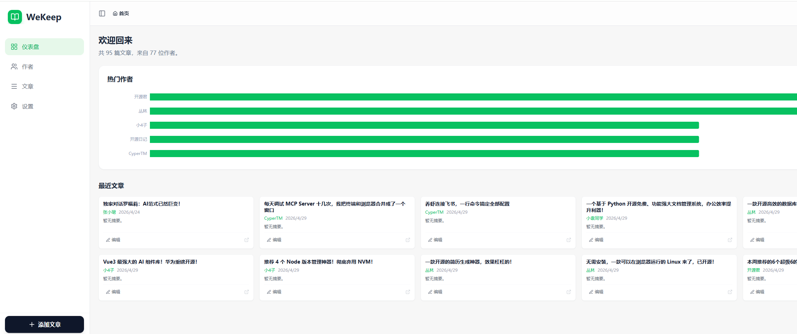
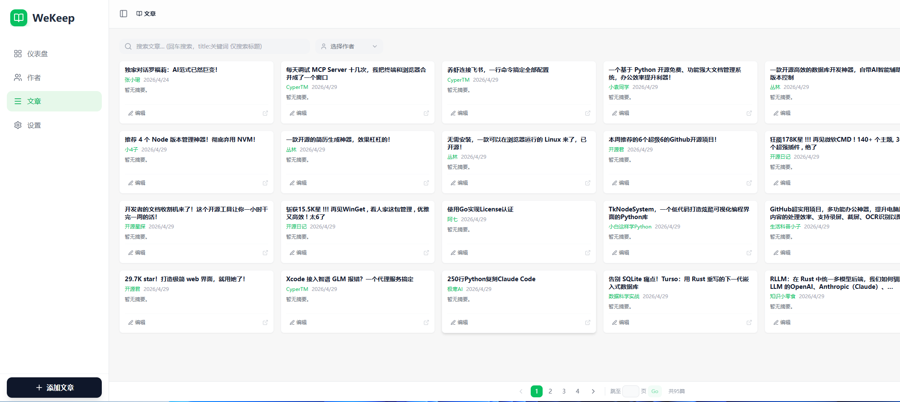
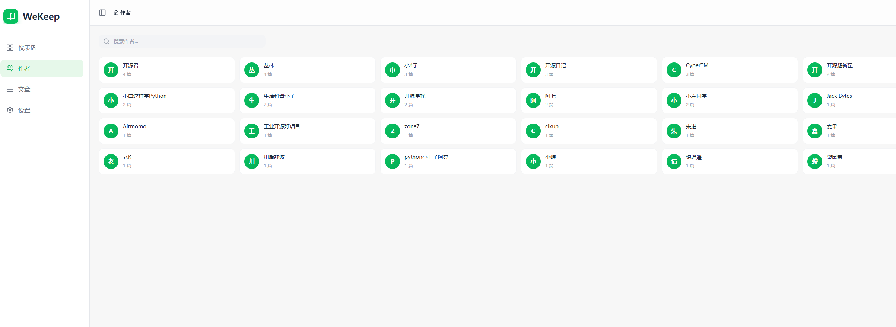
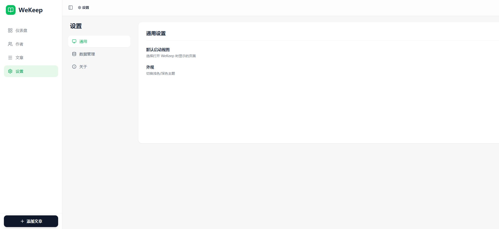

# WeKeep

English | [简体中文](README.md)

> A WeChat Official Account article bookmarking tool — one-click save, full-text search, image localization, and AI-driven management.

[](https://ghcr.io/cicbyte/wekeep)
[](https://github.com/cicbyte/wekeep/actions)
[](https://go.dev/)
[](LICENSE)

   

## Features

- **Article Bookmarking** — Crawl WeChat Official Account articles, extract title/author/content/images, convert to Markdown
- **Full-Text Search** — Powered by Meilisearch, search across titles, authors, summaries, and content
- **Image Localization** — Auto-download article images to local storage or S3-compatible backends
- **AI Integration** — Built-in MCP Server for direct article management from Claude, Cursor, and other AI clients
- **Categories & Tags** — Flexible categorization and tagging system
- **Author Management** — Auto-extract author info, browse articles by author
- **Zero Config** — Auto-generates default config on first run, uses SQLite out of the box

## Tech Stack

| Layer | Technology |
|-------|-----------|
| Backend | Go 1.24 / GoFrame v2.10.0 / MySQL / SQLite |
| Frontend | React 19 / TypeScript 5.8 / Vite 6.2 / Tailwind CSS |
| Search | Meilisearch (optional) |
| Storage | Local filesystem / S3-compatible (RustFS) |
| AI | Gemini API (article parsing) / MCP Server (AI tool integration) |

## Quick Start

### Pre-built Binary

Download the archive for your platform from [Releases](https://github.com/cicbyte/wekeep/releases), extract and run:

```bash
./wekeep
```

On first run, `manifest/config/config.yaml` is auto-generated with SQLite as the default database — no extra dependencies needed.

### Build from Source

**Requirements:** Go 1.24+, Node.js 22+

```bash
# Clone the repo
git clone https://github.com/cicbyte/wekeep.git
cd wekeep

# Build the frontend
cd web && npm i && npm run build && cd ..
mkdir -p resource/public/html && cp -r web/dist/* resource/public/html/

# Run
gf run
```

The backend listens on `:8000` by default.

## Configuration

On first run, `manifest/config/config.yaml` is auto-generated with these defaults:

```yaml
server:
  address: ":8000"

database:
  default:
    link: "sqlite::@file(wekeep.db)"    # SQLite by default, zero dependencies

storage:
  type: "local"
  local:
    basePath: "uploads"

search:
  enabled: false                          # Enable after installing Meilisearch
```

Switch to MySQL:

```yaml
database:
  default:
    link: "mysql:root:password@tcp(127.0.0.1:3306)/wekeep?charset=utf8mb4&parseTime=true&loc=Local"
```

See [`manifest/config/config.yaml.example`](manifest/config/config.yaml.example) for the full config template.

## Docker Deployment

Pull from GHCR:

```bash
docker pull ghcr.io/cicbyte/wekeep:latest

docker run -d -p 8000:8000 \
  -v ./manifest:/app/manifest \
  -v ./log:/app/log \
  -v ./uploads:/app/uploads \
  -v ./db:/app/db \
  ghcr.io/cicbyte/wekeep:latest
```

Or build from source:

```bash
docker build -t wekeep .
```

Volume mounts:

| Host Path | Container Path | Description |
|-----------|---------------|-------------|
| `./manifest` | `/app/manifest` | Config files (`config.yaml` auto-generated on first run) |
| `./log` | `/app/log` | Logs |
| `./uploads` | `/app/uploads` | Uploaded files |
| `./db` | `/app/db` | SQLite database file |

## MCP Server

WeKeep includes a built-in MCP Server, allowing AI clients like Claude Desktop and Cursor to manage articles directly.

**Endpoint:** `http://localhost:8000/mcp` (StreamableHTTP)

**Configuration example (Claude Desktop):**

```json
{
  "mcpServers": {
    "wekeep": {
      "url": "http://localhost:8000/mcp"
    }
  }
}
```

**Available tools:**

| Tool | Description |
|------|-------------|
| `wechat_parse_url` | Parse a WeChat article URL, extract title/author/content |
| `wechat_save_article` | Save an article to your collection |
| `wechat_list_articles` | List articles (with pagination) |
| `wechat_get_article` | Get a single article's details |
| `wechat_search_articles` | Full-text search articles |
| `wechat_get_tags` | Get all tags |
| `wechat_get_stats` | Get article statistics |
| `wechat_delete_article` | Delete an article |

## Project Structure

```
wekeep/
├── api/v1/                  # API request/response definitions (g.Meta route tags)
├── internal/
│   ├── controller/          # HTTP controllers
│   ├── service/             # Service interface definitions
│   ├── logic/               # Business logic (auto-registered via init())
│   ├── dao/                 # Data access layer (auto-generated, do not edit)
│   ├── model/               # Data models (entity/do/info)
│   ├── parser/              # WeChat article HTML parser
│   ├── storage/             # Storage abstraction (Local / S3)
│   ├── mcp/                 # MCP Server (StreamableHTTP)
│   └── router/              # Route registration
├── library/
│   ├── libMeilisearch/      # Meilisearch client wrapper
│   └── libRouter/           # Auto route binding
├── web/                     # React frontend
├── resource/
│   ├── public/html/         # Frontend build output (embedded in binary)
│   └── sql/                 # Database init scripts (embedded in binary)
├── scripts/                 # Build/release scripts
├── manifest/config/         # Configuration files
├── Dockerfile               # Multi-stage build
└── .github/workflows/       # CI/CD
```

## API

| Module | Path | Description |
|--------|------|-------------|
| Articles | `/api/v1/articles` | CRUD, search, Gemini parsing |
| Categories | `/api/v1/categories` | Category management |
| Authors | `/api/v1/authors` | Author management |
| Images | `/api/v1/images` | Image management, file proxy |
| Search | `/api/v1/search/*` | Full-text search |
| Storage | `/api/v1/storage/*` | Storage backend management |
| MCP | `/mcp/*` | MCP Server (StreamableHTTP) |
| System | `/api/v1/health/*` | Health check, version info |

## License

[MIT](LICENSE)
